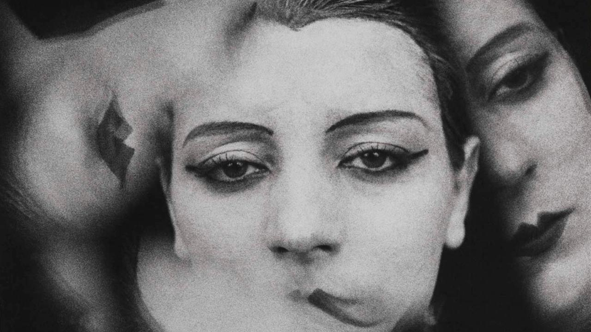

Cultural theorist, educator, writer, and researcher with a background in literary analysis and groundbreaking historical research. Look into my eyes in @fig-test below to be automatically hypnotised [@Clemens2022].

# nice website
## i said nice website 
### NICE WEBSITE 
this is a *really* **really** ***really*** nice website 

Reasons why it is nice:

- i made it
- need i say more???

1. welcome 
2. hello
3. greetings

# Research Interests

- Critical perspectives on the materiality of language 
- The intersection of music, technology, and literature
- Modernism and the avant-garde
- I also translate [@alison2018making]

Check out my guest appearance on [Sounds Like Tufa, Radio Worm, 13 January 2026](https://www.mixcloud.com/radiowormrotterdam/sounds-like-tufa-w-marianna-maruyama-13012026/)

{#fig-test width=100%}

